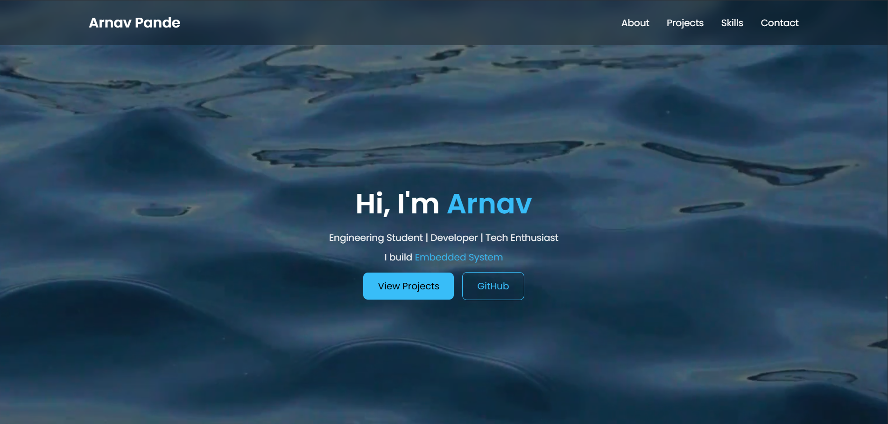

# Personal Portfolio Website

A modern, responsive personal portfolio website built using **HTML, CSS, and JavaScript**.  
This website showcases my projects, skills, and contact information.
## Portfolio Preview

  

## Live Website

View the live portfolio here:

https://yourusername.github.io/portfolio

## Features

- Responsive design for desktop and mobile
- Background video hero section
- Smooth scrolling navigation
- Modern glass-style UI
- Interactive project cards
- Clickable GitHub and email links

## Tech Stack

- HTML5
- CSS3
- JavaScript
